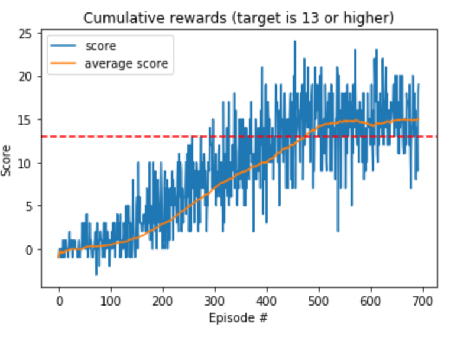

**Udacity's Deep Reinforcement Learning Nanodegree**

# Report on Navigation Project

## Learning Algorithm

The agent is learning the policy using reinforcement learning method by follow the below steps;

1. Choose an action based on the current state using the policy
2. Apply the chosen action to the environment to receive;
   - Reward, which tells whether the action is good or bad,
   - Next state, which is the resulting state after taking the action,
   - Done, which tells whether the episode is finished or not
3. Put the information acquired at Step 2 into the replay buffer, and execute learning algorithm every given steps (in this case, 4 steps)
   - For learning, it randomly picks samples for mini-batch from the replay buffer,
   - Calculate the target return using the target network as;
     - target return = reward + $\gamma max \hat{Q}(next state, action, \theta_{target}) ​$ 
   - Calculate the expected return using the local network as;
     - expected return = $max Q(state, \theta_{local})​$ 
   - Then, compute loss using MSE between the target and expected returns, and run stochastic gradient descent to update the weights of the local network
     - Loss = MSE(target return, expected return)
   -  In this implementation, the weights of the target network is being updated gradually rather than copying all the weights of the local network into the target network.
     - $\theta_{target}$ = $\tau \times \theta_{local} + (1-\tau) \times \theta_{target}$  
   - Please refer to [DQN paper](https://storage.googleapis.com/deepmind-media/dqn/DQNNaturePaper.pdf) for further detail.

Code snippet of this process is given below and the full code is in [Navigation.ipynb](./Navigation.ipynb) and  [dqn_agent.py](./dqn_agent.py)

```py
# Step 1 ~ Step 2
action = agent.act(state, eps)
env_info = env.step(action)[brain_name]
next_state, reward, done = extract_info(env_info)
agent.step(state, action, reward, next_state, done)
state = next_state
score += reward
if done:
	break
	
# Step 3
states, actions, rewards, next_states, dones = experiences

Q_targets_next = self.qnetwork_target(next_states).detach().max(1)[0].unsqueeze(1) 
Q_targets = rewards + (gamma * Q_targets_next * (1-dones))
Q_expected = self.qnetwork_local(states).gather(1, actions) 

loss = F.mse_loss(Q_expected, Q_targets)
self.optimizer.zero_grad()
loss.backward()
self.optimizer.step()

# ------------------- update target network ------------------- #
self.soft_update(self.qnetwork_local, self.qnetwork_target, TAU)    
```

## Network Architecture for Deep Q-Network (DQN)

Neural network for DQN is a multilayer perceptron with 3 hidden layers which has 64 hidden units each. ReLU activation function is applied to each hidden layer. Dropout is defined and applied to the output of activation outputs, but the dropout probability is set as 0 which disables dropout for now.

```py
class QNetwork(nn.Module):
    """Actor (Policy) Model."""

    def __init__(self, state_size, action_size, seed, fc1_units=32, fc2_units=32, fc3_units=32):
        """Initialize parameters and build model.
        Params
        ======
            state_size (int): Dimension of each state
            action_size (int): Dimension of each action
            seed (int): Random seed
        """
        super(QNetwork, self).__init__()
        self.seed = torch.manual_seed(seed)
        self.fc1 = nn.Linear(state_size, fc1_units)
        self.fc2 = nn.Linear(fc1_units, fc2_units)
        self.fc3 = nn.Linear(fc2_units, fc3_units)
        self.fc4 = nn.Linear(fc3_units, action_size)
        self.dropout = nn.Dropout(0)

    def forward(self, state):
        x = self.dropout(F.relu(self.fc1(state)))
        x = self.dropout(F.relu(self.fc2(x)))
        x = self.dropout(F.relu(self.fc3(x)))
        return self.fc4(x)
```

## Experiments

Starting MLP with 2 hidden layers, I ended up with an MLP with 3 hidden layer which give a good performance. I also applied dropout, but it won't help much.

```
Episode 100	Average Score: 0.45 in 0.79 sec
Episode 200	Average Score: 2.90 in 0.81 sec
Episode 300	Average Score: 6.97 in 0.82 sec
Episode 400	Average Score: 10.02 in 0.82 sec
Episode 500	Average Score: 14.02 in 0.85 sec
Episode 600	Average Score: 14.36 in 0.83 sec
Episode 694	Average Score: 15.05 in 0.82 sec
Environment solved in 594 episodes!	Average Score: 15.05	Min Score: 7.00
```

## Plot of Rewards

The best performing agent has been trained with 694 episodes which gives the average rewards over previous 100 episodes as 15.05. The below plot shows the cumulative rewards and the average scores.



As seen in the above plot, the average score starts to be saturated after about 500 episodes. Why? I need to investigate further :)

```
[](https://youtu.be/I2NdbYmBB0M)
```

## Ideas for Future Work

Different methods of DQN could be applied to find which one effectively improves the performance. They are

- [Double DQN](https://www.ri.cmu.edu/pub_files/pub1/thrun_sebastian_1993_1/thrun_sebastian_1993_1.pdf)
- [Prioritized Experience Replay]
- [Dueling DQN]
- [Rainbow]

